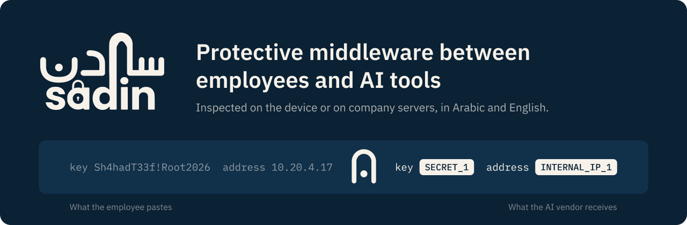
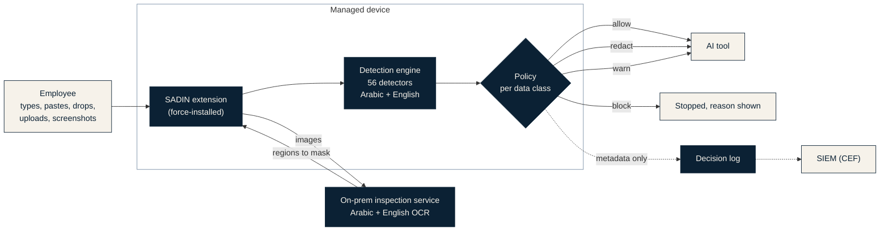
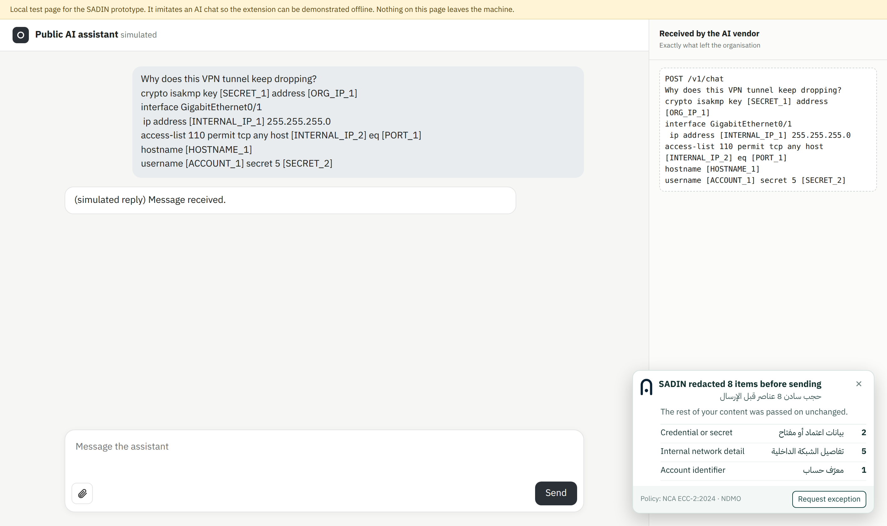
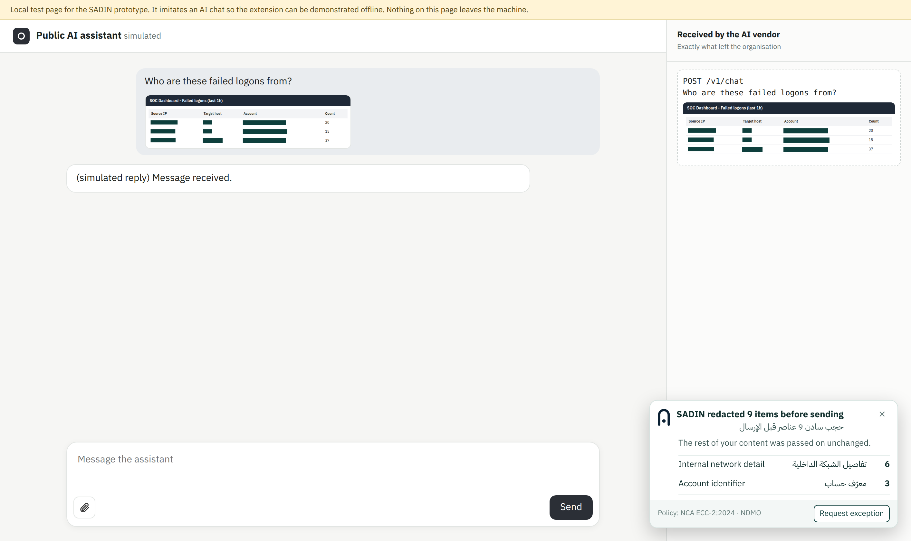
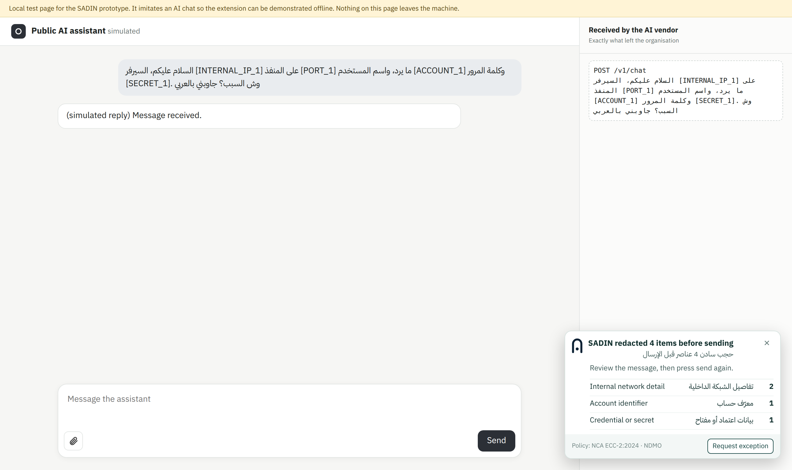
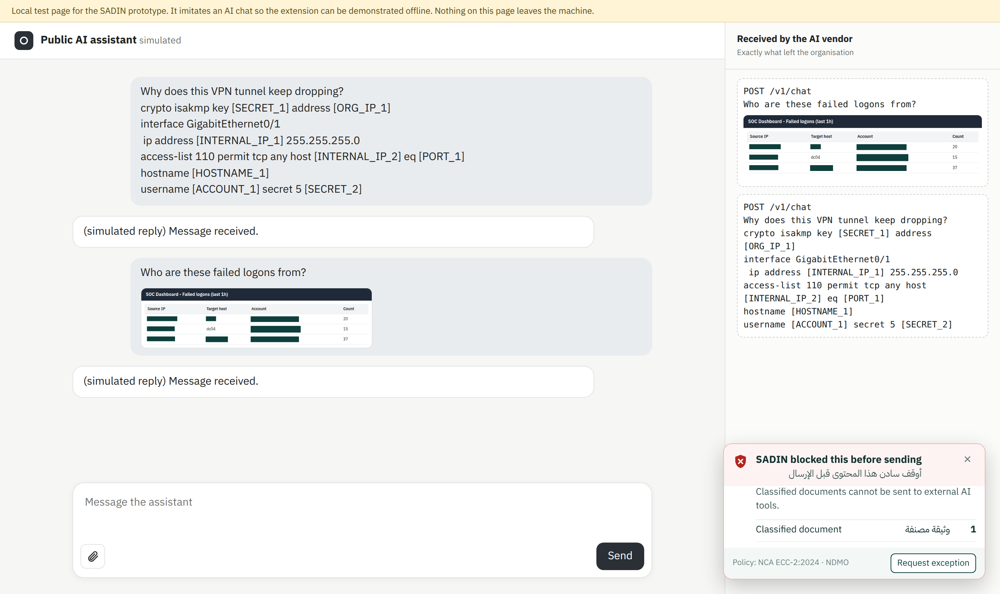
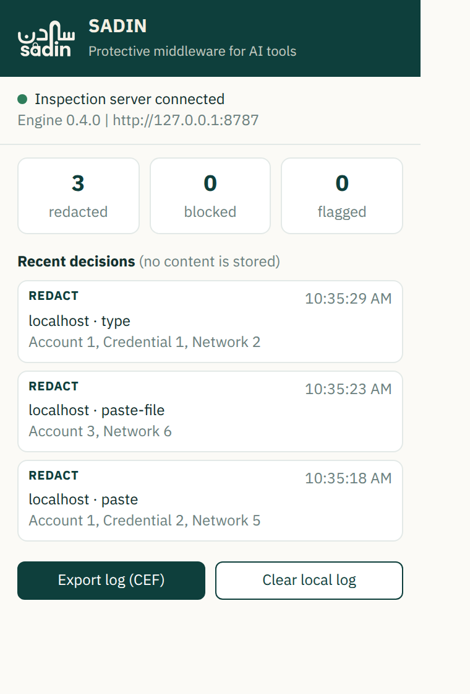

<p align="center">
  
</p>

<p align="center">
  
  
  
  
  
  
</p>

<p align="center">
  <a href="#the-problem">The problem</a> &nbsp;|&nbsp;
  <a href="#how-it-works">How it works</a> &nbsp;|&nbsp;
  <a href="#see-it-work">Demo</a> &nbsp;|&nbsp;
  <a href="#results">Results</a> &nbsp;|&nbsp;
  <a href="#quick-start">Quick start</a> &nbsp;|&nbsp;
  <a href="#documentation">Docs</a> &nbsp;|&nbsp;
  <a href="#references">References</a>
</p>

---

**SADIN** (سادن, the custodian who keeps a gate) is a protective middleware that sits between
employees and generative AI tools. Everything an employee types, pastes, drops or uploads into
an AI tool passes through SADIN first. Credentials, internal network details and account
identifiers are replaced with placeholders, classified documents are stopped, and every
decision is logged. The employee still gets an answer from the AI; the organisation's secrets
never reach the vendor.

All inspection runs on the employee's device or on the organisation's own server. A middleware
that shipped the data to another cloud would recreate the problem it exists to solve.

## The problem

An engineer stuck on a VPN tunnel pastes the router configuration into an AI assistant. A SOC
analyst pastes a dashboard screenshot and asks who the failed logons came from. Nobody means
harm, but the pre-shared key, the internal addresses and the admin account names now sit in a
third party's chat history, and attackers do not need to break into the organisation to reach
them:

| Path | What happened |
|---|---|
| Stolen AI accounts | Group-IB found more than 225,000 infostealer logs containing ChatGPT credentials offered for sale between January and October 2023. Whoever buys a login can read the full chat history. |
| Chats shared by link | In July 2025, Fast Company found nearly 4,500 shared ChatGPT conversations in Google results; OpenAI then removed the option that made them discoverable. |
| Retention by the vendor | In March 2023, Samsung semiconductor engineers entered source code and meeting content into ChatGPT in three separate incidents within about 20 days; Samsung then banned generative AI tools on company devices from May 2023. |

Sources for each case are listed under [References](#references).

Blocking AI sites does not work either: usage moves to personal phones and the organisation
loses both visibility and the productivity gain. SADIN takes the third path: keep AI, remove
the secrets.

## How it works



One policy engine decides what happens to each class of data, and three enforcement points
apply it. The **Agent** (browser extension, plus an endpoint agent in Phase 2) covers managed
devices and is built. The **Identity** layer (SSO on an enterprise AI tenant with conditional
access) and the **Gateway** (reverse proxy for unmanaged devices) are designed and on the
roadmap. Details: [docs/ARCHITECTURE.md](docs/ARCHITECTURE.md).

### What it looks for

SADIN protects the organisation's own secrets, the things an attacker could use against it.

| Data class | Examples | Default action |
|---|---|---|
| Classified documents | "Secret", "سري للغاية", "التصنيف: مقيد", classification stamps on scanned memos | Block |
| Credentials and keys | Passwords (including "الباسوورد"), API keys, tokens, private keys, pre-shared keys, SNMP communities, `.env` values | Redact |
| Network details | Internal IPv4 and IPv6, hostnames, ports and port lists, MAC addresses, the organisation's public ranges, Arabic-Indic digits (١٠.١٥.٢.٢٠) | Redact |
| Account identifiers | Work email addresses, `DOMAIN\user` accounts, employee IDs, usernames (including "اليوزر") | Redact |
| Security findings | Scanner output, penetration-test markers, "ثغرة لم تُرقّع" style wording | Warn |

Actions are set per data class by IT through Chrome policy. Anything SADIN cannot inspect
(PDF and Office files today, images while the inspection service is unreachable) is blocked
rather than waved through. Detector list and Arabic handling:
[docs/DETECTION.md](docs/DETECTION.md).

## See it work

The demo runs on a local page that imitates an AI chat. The right-hand panel shows exactly what
the AI vendor would receive.

<table>
  <tr>
    <td width="50%"></td>
    <td width="50%"></td>
  </tr>
  <tr>
    <td>A router configuration is pasted. The pre-shared key, the password hash, the organisation's public address, both internal addresses, the port, the hostname and the account are replaced; the question still reaches the AI.</td>
    <td>A SOC dashboard screenshot is pasted. The on-prem service reads it with OCR and the sensitive cells are masked in the image itself. One short hostname (dc04) was missed, as reported in the evaluation.</td>
  </tr>
  <tr>
    <td></td>
    <td></td>
  </tr>
  <tr>
    <td>An Arabic request with an IP address in Arabic-Indic digits, a port, a username and a password. All four are replaced and the Arabic question arrives intact.</td>
    <td>A classified document is stopped before sending. Nothing reaches the vendor, and the employee sees why and can request an exception.</td>
  </tr>
</table>

<details>
<summary>The decision log (extension popup)</summary>
<br>
<p align="center"></p>
<p>Each decision records who, which tool, which channel, the action and the data classes found.
The content itself is never stored. The log exports to a SIEM in CEF format.</p>
</details>

## Results

Held-out test sets, written and frozen before the run, first run, no tuning afterwards.

| Metric | Result |
|---|---|
| Sensitive items caught in text | **86.3%** (44 of 51) |
| False positives on clean business prompts | **0 of 50** |
| Screenshot values masked (on-prem OCR) | **95.8%** (69 of 72) |
| Classified Arabic memos blocked in screenshots | **8 of 8** (4 with a stamp, 4 with a written classification line) |
| Arabic items caught (Arabic held-out set) | **36 of 36**, 1 false positive in 40 |
| Time per message / 1 MB paste / screenshot | under 0.1 ms / about 0.2 s / about 1.7 s |

Before the Arabic work (engine v0.3.1), the same Arabic held-out set scored 50.0% (18 of 36).
The test sets are synthetic and were written by the team, so they show the approach works on
realistic phrasing, not how it performs on an organisation's real traffic; a consented pilot is
the next step. Method, raw outputs, bugs the tests found and limitations:
[EVALUATION.md](EVALUATION.md).

## Quick start

Requirements: Node.js 18+, Chrome or Edge, and for image inspection Tesseract 5 with the
`ara` and `eng` language data (ImageMagick optional).

```bash
# 1. on-prem inspection service (text works without it; images need it)
TESSDATA_PREFIX=/path/to/tessdata node server/server.js   # http://127.0.0.1:8787

# 2. local test page that imitates an AI chat
node demo/serve.js                                        # http://localhost:8788

# 3. load the extension
#    chrome://extensions  >  Developer mode  >  Load unpacked  >  select extension/
```

Then paste a firewall configuration, type a password, upload a `.env` file or paste a
screenshot into the test page. The extension is also configured for ChatGPT, Claude, Gemini,
Copilot, Perplexity, DeepSeek, Mistral and Poe.

### Reproduce the numbers

```bash
node eval/run.js --holdout            # English held-out set
node eval/run.js --set=arabic-holdout # Arabic held-out set
node eval/run.js                      # English development set
node eval/run.js --set=arabic-dev     # Arabic development set
sha256sum -c eval/FROZEN-arabic.sha256
TESSDATA_PREFIX=... SADIN_SEED=990011 node eval/ocr-eval.js   # screenshots
node eval/e2e-browser.js              # real browser, needs demo/serve.js running
```

### Deploy in an organisation

Force-install the extension with the `ExtensionInstallForcelist` policy, push `serverUrl`,
`serverToken`, `orgDomains`, `orgPublicCidrs` and the per-class actions through managed
storage, and run the inspection service on an internal VM with `SADIN_TOKEN` and
`SADIN_EXTENSION_IDS` set. Roll out in monitor-only mode, then warn, then enforce. Step by
step, with example policy files: [docs/DEPLOYMENT.md](docs/DEPLOYMENT.md).

## Project status

| Component | Status |
|---|---|
| Browser extension (Chrome, Edge; Manifest V3) | Built and tested |
| Detection and redaction engine, Arabic and English | Built and tested |
| On-prem inspection service: OCR, stamp reading, policy, log, CEF export | Built and tested |
| Evaluation harness, held-out sets, real-browser test | Built |
| Office and PDF parsing, endpoint agent, sensitivity labels | Phase 2 (pilot) |
| Enterprise AI tenant, SSO and conditional access, personal-account blocking | Phase 3 |
| Gateway mode for unmanaged devices | Phase 4 |

## Documentation

| Document | What it covers |
|---|---|
| [Concept and technical report](docs/SADIN_Report_SAIF2026.pdf) | The full report: problem, threat model, design, detection, security, compliance, results, roadmap |
| [Architecture](docs/ARCHITECTURE.md) | Enforcement points, components, request lifecycle, what is built and what is designed |
| [Detection](docs/DETECTION.md) | Data classes, all 56 detectors, Arabic handling, OCR pipeline, redaction |
| [Threat model](docs/THREAT-MODEL.md) | How data leaves, what SADIN covers, what it cannot, threats to SADIN itself |
| [Deployment](docs/DEPLOYMENT.md) | Force-install, managed settings, server hardening, rollout |
| [Compliance](docs/COMPLIANCE.md) | NCA ECC-2:2024 and NDMO classification mapping, human oversight |
| [Evaluation](EVALUATION.md) | Test method, results, raw outputs, limitations |
| [Security policy](SECURITY.md) | Reporting issues, security properties of the prototype |
| [Changelog](CHANGELOG.md) | What changed between versions |
| [Poster](docs/SADIN_Poster_SAIF2026.pdf) | SAIF 2026 scientific poster |

## Repository layout

```
extension/   Chrome/Edge extension. src/engine.js is the detection engine shared by all parts.
server/      On-prem inspection service. No npm dependencies.
demo/        Local test page that imitates an AI chat.
eval/        Test sets, harness and raw results.
shots/       Screenshots of the prototype in use.
docs/        Report, architecture, detection, threat model, deployment, compliance, poster.
assets/      Logo, app icon, banner.
```

## References

1. National Cybersecurity Authority (NCA). *Essential Cybersecurity Controls, ECC-2:2024*. Riyadh, 2024.
2. National Data Management Office (NDMO), SDAIA. *National Data Governance Policies: Data Classification Policy*. [sdaia.gov.sa](https://sdaia.gov.sa/ar/SDAIA/about/Documents/Data%20Classification%20Policy.pdf)
3. Group-IB. "Group-IB Discovers 100K+ Compromised ChatGPT Accounts on Dark Web Marketplaces." Press release, 20 June 2023. [group-ib.com](https://www.group-ib.com/media-center/press-releases/stealers-chatgpt-credentials/)
4. Group-IB. *Hi-Tech Crime Trends 2023/2024*. February 2024. [prnewswire.com](https://www.prnewswire.com/news-releases/group-ib-reveals-hi-tech-crime-trends-2324-surge-in-ransomware-against-backdrop-of-growing-ai-macos-threats-302075538.html)
5. The Economist Korea, 30 March 2023; Bloomberg, "Samsung Bans Staff's AI Use After Spotting ChatGPT Data Leak," 2 May 2023.
6. Fast Company, July 2025, investigation of shared ChatGPT conversations indexed by Google; OpenAI's removal of the discoverability option, as reported by PC Gamer, August 2025. [pcgamer.com](https://www.pcgamer.com/software/ai/chatgpt-removes-the-ability-for-conversations-to-be-displayed-by-search-engines-as-nearly-4-500-conversations-indexed-by-google/)
7. Google, Chrome for Developers. "Replace blocking web request listeners" (Manifest V3; `webRequestBlocking` remains available to policy-installed extensions). [developer.chrome.com](https://developer.chrome.com/docs/extensions/develop/migrate/blocking-web-requests)
8. OWASP. *Top 10 for Large Language Model Applications 2025*: LLM02 Sensitive Information Disclosure.
9. Tesseract OCR, open-source OCR engine. [github.com/tesseract-ocr/tesseract](https://github.com/tesseract-ocr/tesseract)
10. Saudi Press Agency. "Registration Opens for Global Security and Innovation Fair and Competition," 22 July 2026. [spa.gov.sa](https://www.spa.gov.sa/en/N2639485)
11. SAIF 2026 participant guide (official competition guide supplied to participants).

## About

SADIN is an entry to SAIF 2026, the Security & Innovation Fair, in Track 02: Cybersecurity and
Defensive Technologies.

All values in the test sets are fabricated, including the API keys and tokens in `eval/`, which
only look real so the detectors can be tested against them. None of them is a live credential.
