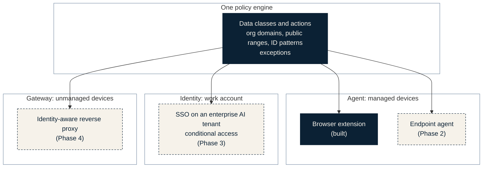
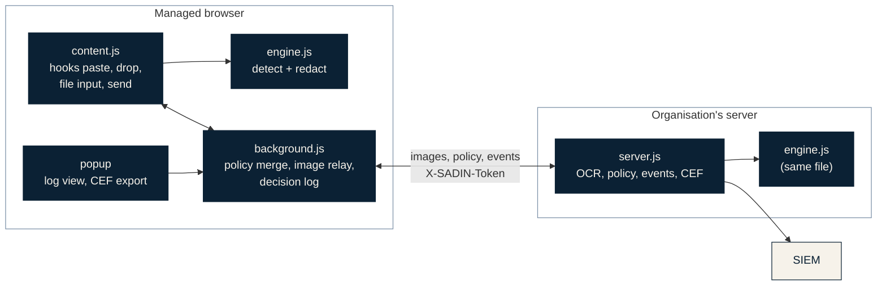
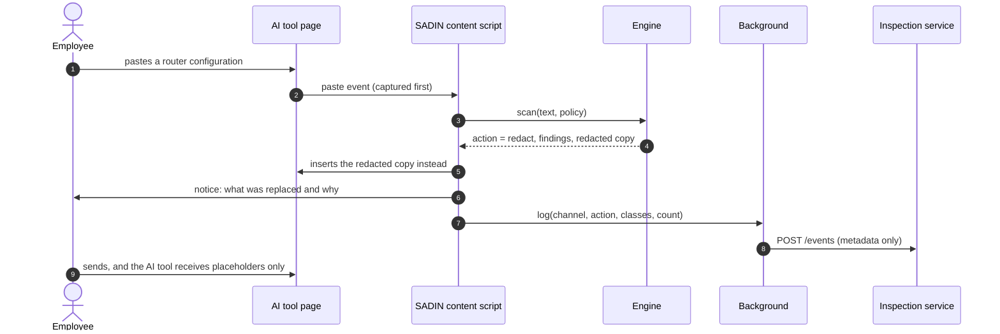

# Architecture

SADIN is a middleware: it stands between the employee and every AI tool, and everything the
employee sends passes through it. It is built from **one policy engine** and **three
enforcement points**, and it follows four rules throughout.

1. **Inspect locally.** Content is inspected on the device or on the organisation's own
   server. Nothing is sent to a SADIN cloud, because there is none.
2. **Redact before blocking.** Remove the sensitive part and let the rest through, so the
   employee still gets help.
3. **Fail closed.** Content SADIN cannot inspect is blocked, not waved through.
4. **Log decisions, not content.** The log records who, which tool, which channel, which action
   and which data classes. Never the text or the image.

## Enforcement points



| Enforcement point | Covers | State |
|---|---|---|
| **Agent: browser extension** | Typed, pasted and dragged text, file uploads and pasted or uploaded images in any AI chat site on a managed Chrome or Edge browser | Built and tested |
| **Agent: endpoint agent** | Desktop AI apps, IDE assistants, the clipboard, Office and PDF parsing, device posture | Designed, Phase 2 |
| **Identity** | AI access only through the work account on an enterprise AI tenant; company data only on compliant devices; personal AI accounts blocked on work devices | Designed, Phase 3 |
| **Gateway** | Sessions from unmanaged devices routed through a reverse proxy that applies the same policy | Designed, Phase 4 |

The Identity layer closes most of the personal-device gap at its source: if company email,
files and systems are only reachable from managed devices, an employee on a home laptop has no
company data to paste.

## Components in this repository



| Component | File | Role |
|---|---|---|
| Content script | `extension/src/content.js` | Runs inside AI tool pages. Intercepts paste, drop, file-input changes and send (Enter or the send button), asks the engine, then lets the sanitised content through, blocks it, or shows a notice. |
| Detection engine | `extension/src/engine.js` | 56 detectors across five data classes, Arabic and English. Returns findings (class, detector, character span) and a redacted copy. Pure JavaScript, no dependencies; the extension, the server and the tests run the same file. |
| Background worker | `extension/src/background.js` | Merges the policy (built-in defaults, then the policy server, then Chrome managed storage set by IT, which wins). Relays images to the inspection service. Keeps the last 500 decisions locally and forwards each one to the server. |
| Popup | `extension/popup/` | Shows server status and recent decisions; exports the local log as CEF. |
| Managed settings | `extension/managed_schema.json` | The settings IT pushes by policy: `serverUrl`, `serverToken`, `userEmail`, org domains and ranges, per-class actions, fail-closed behaviour. |
| Inspection service | `server/server.js` | Arabic and English OCR with Tesseract, a second pass for coloured classification stamps, image masking coordinates, `/policy`, `/events`, `/events.cef`. Node only, no npm dependencies. |
| Test page | `demo/` | A local page that imitates an AI chat and shows exactly what the vendor would receive. |

## Request lifecycle

### Text: paste, drop or send



Typed text is checked at send time. If it needs redaction, SADIN replaces the text in the
message box, stops that send, and asks the employee to review and send again, so nothing leaves
without the employee seeing what changed.

### Images: paste or upload

1. The content script holds the image and asks the background worker to send it to the
   inspection service.
2. The service upscales small screenshots, runs Tesseract with Arabic and English, and runs a
   second pass over coloured ink to read boxed classification stamps that ordinary page
   segmentation skips.
3. The recognised words go through the same engine. The service returns the action, the data
   classes and the rectangles to mask. It never echoes the recognised text back.
4. If the action is block, the image is stopped. Otherwise the content script paints over the
   rectangles on a canvas and passes the masked copy to the page.
5. If the service is unreachable, images are blocked (fail closed) and the popup says so.

### Files

Text formats (about forty extensions, including `.env`, `.conf`, `.json`, `.yaml`, `.log`,
`.sql`, `.pem` and source code) are read and redacted in the browser, and a sanitised copy replaces the original in the
upload. Formats the prototype cannot parse yet (PDF, Office, archives) follow the
`uninspectableFiles` policy, which is `block` by default.

## Policy

```json
{
  "orgDomains": ["corp.example.sa", "example.sa"],
  "orgPublicCidrs": ["203.0.113.0/24"],
  "employeeIdPattern": "\\bEMP-?\\d{5,6}\\b",
  "failClosed": true,
  "uninspectableFiles": "block",
  "actions": {
    "CLASSIFIED": "block",
    "CREDENTIAL": "redact",
    "NETWORK": "redact",
    "ACCOUNT": "redact",
    "SECURITY_FINDING": "warn"
  }
}
```

Each data class maps to one of four actions: `allow`, `redact`, `warn` or `block`. When a
message contains several classes, the strictest action wins. The employee can request an
exception from the notice; the business justification is logged for the security team, and the
content is still not sent.

## What the log contains

```json
{"time":"2026-09-25T17:21:28.205Z","user":"a.alharbi@corp.example.sa","tool":"chatgpt.com",
 "channel":"paste","action":"redact","categories":{"CREDENTIAL":2,"NETWORK":5,"ACCOUNT":1},
 "placeholders":8}
```

That is the whole record. No text, no image, no matched value. The server writes it to
`events.jsonl` and serves it as CEF at `/events.cef` for SIEM ingestion.
