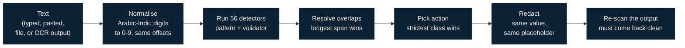

# Detection

Everything below lives in one file, [`extension/src/engine.js`](../extension/src/engine.js). The
browser extension, the on-prem inspection service and the test harness all run that same file,
so the numbers in the evaluation describe the code that runs in the browser.

## What counts as sensitive

SADIN protects the secrets an attacker could use against the organisation. It is deliberately
not a general personal-data scanner: phone numbers and IBANs are not its job.

| Data class | Placeholder labels | Default action | Detectors |
|---|---|---|---|
| `CLASSIFIED` | `CLASSIFIED` | block | 6 |
| `CREDENTIAL` | `SECRET`, `API_KEY`, `TOKEN`, `AWS_KEY`, `AWS_SECRET`, `PRIVATE_KEY` | redact | 24 |
| `NETWORK` | `INTERNAL_IP`, `ORG_IP`, `HOSTNAME`, `PORT`, `MAC` | redact | 16 |
| `ACCOUNT` | `ACCOUNT`, `EMPLOYEE_ID` | redact | 6 |
| `SECURITY_FINDING` | none (flagged, not replaced) | warn | 4 |

## How a message is scanned

1. **Normalise digits.** Arabic-Indic (٠١٢٣٤٥٦٧٨٩) and Eastern Arabic-Indic (۰۱۲...) digits
   and the Arabic decimal separator are mapped one-to-one to ASCII. Because the mapping never
   changes the length of the text, spans found in the normalised copy redact exactly the right
   characters in the original, so `١٠.١٥.٢.٢٠` is caught and replaced as written.
2. **Detect.** Each detector is a pattern plus, where needed, a validator: port numbers must be
   1 to 65535, IPv4 addresses must parse and fall in a private range or in one of the
   organisation's public ranges, password candidates must mix character classes, and common
   non-secrets (`changeme`, `${VAR}`, `****`, `null`) are rejected.
3. **Resolve overlaps.** When two findings overlap, the longer one wins; on a tie the more
   sensitive class wins (classified, then credential, account, network, finding).
4. **Pick the action.** Each class maps to `allow`, `warn`, `redact` or `block` by policy. The
   strictest one present decides the message.
5. **Redact.** Each distinct value gets a numbered placeholder, and a repeated value gets the
   same placeholder every time, so the AI can still reason about the structure:
   `ip address [INTERNAL_IP_1] ... permit tcp any host [INTERNAL_IP_2] eq [PORT_1]`.
6. **Re-scan.** The redacted text is scanned again and must not trigger anything. This check
   found a real bug: the engine used to re-detect its own placeholders, so a redacted message
   could never be sent.

## Arabic

Saudi employees write to AI tools in Arabic, in English, or in both within one sentence. Before
v0.4.0 the engine caught about half of the Arabic items in a held-out set; after the changes
below it caught 36 of 36.

| Problem | Fix |
|---|---|
| `\b` word boundaries do not work in Arabic script, so `المنفذ 8443` was never matched | Explicit "not an Arabic letter" guards instead of `\b` |
| Arabic-Indic digits were invisible to every numeric pattern | Digit normalisation before scanning (above) |
| Colloquial terms: الباسوورد، الباس، اليوزر، بورت | Added to the keyword lists, with and without the article |
| Keyword and value a few words apart: "كلمة السر حقت الإيميل: …" | Up to four Arabic words allowed between keyword and value |
| Diacritics inside keywords | Keywords tolerate tashkeel between letters |
| Port lists: "المنافذ ٢١ و٢٢ و٣٣٨٩" | A list detector that redacts every port in the list |
| Findings in Arabic: "CVE-… لم تُرقّع" | Arabic vulnerability wording near a CVE is flagged |
| Classification markings | سري، سري للغاية، مقيد، "التصنيف: …"، "وثيقة سرية", and a marking alone on a line (how stamps read after OCR) |

## Detectors

<b>CREDENTIAL</b> (24)

| Detector | Catches |
|---|---|
| `private_key_block` | PEM private key blocks (RSA, EC, DSA, OpenSSH, PGP, encrypted) |
| `aws_access_key`, `aws_secret` | AWS access key IDs and secret keys |
| `github_token`, `openai_anthropic_key`, `stripe_key`, `slack_token`, `google_api_key` | Provider-format API keys and tokens |
| `azure_conn` | `AccountKey=`, `SharedAccessKey=`, `Password=` in connection strings |
| `jwt`, `bearer` | JSON Web Tokens, `Bearer` and `Basic` authorization values |
| `url_credentials` | Passwords inside database, LDAP, FTP and HTTP URLs |
| `assignment_secret` | `password=`, `api_key:`, `client_secret` and similar in configs and `.env` files |
| `device_secret`, `psk`, `device_key`, `snmp_community`, `username_password_line` | Cisco and network-device secrets: type 5/7 passwords, pre-shared keys, `crypto isakmp key`, TACACS and RADIUS keys, SNMP communities |
| `password_is`, `cli_password` | "the password was changed to …", `mysql -p…`, `--password=…`, basic-auth pairs |
| `ar_password_is`, `ar_password`, `ar_password_ctx` | كلمة المرور / السر، الرقم السري، الباسوورد، الباس، رمز الدخول, with a colon or "هي / هو / صار" |
| `high_entropy` | Fallback for long random-looking strings (24+ characters, 4+ bits of entropy per character), excluding UUIDs and plain words |

<b>NETWORK</b> (16)

| Detector | Catches |
|---|---|
| `private_ipv4` | Private-range IPv4 addresses (RFC 1918 and similar), with optional CIDR suffix |
| `org_public_ip` | Public addresses inside the organisation's own ranges (`orgPublicCidrs`) |
| `ipv6_ula` | Internal IPv6 (fc00::/7) |
| `mac_address` | MAC addresses in colon, dash and Cisco dotted formats |
| `internal_hostname` | Names under `.local`, `.lan`, `.corp`, `.internal`, `.intranet` or the organisation's domains |
| `host_convention` | Naming conventions such as `DC01`, `SRV-DB-02`, `fw-core-1`, `app-prod-05` |
| `port_context`, `host_port`, `proto_port`, `proto_port_rev`, `cli_port` | Ports after `port`, `eq`, `listen`, in `host:port`, `443/tcp`, `tcp/443`, `ssh -p 2222` |
| `ar_port`, `ar_port_list`, `ar_port_colloquial` | المنفذ، المنافذ، البورتات، بورت, including lists |
| `ar_hostname_ctx` | اسم الجهاز / الخادم / السيرفر followed by a name |
| `ocr_private_ip` | Private addresses with one malformed octet, used only on OCR output |

<b>ACCOUNT</b> (6)

| Detector | Catches |
|---|---|
| `org_email` | Email addresses on the organisation's domains |
| `domain_account` | `DOMAIN\user` accounts |
| `employee_id` | The organisation's employee ID format (`employeeIdPattern`) |
| `config_username` | `username`, `user=`, `login:`, `uid=` in configs |
| `ar_username`, `ar_account_ctx` | اسم المستخدم، اليوزر، الحساب followed by an identifier |

<b>CLASSIFIED</b> (6)

| Detector | Catches |
|---|---|
| `label_en_caps` | TOP SECRET, SECRET, CONFIDENTIAL, RESTRICTED, INTERNAL USE ONLY, FOR OFFICIAL USE ONLY, written as markings |
| `label_en_field` | "Classification: Secret" and similar fields |
| `label_ar_top` | سري للغاية، سري جداً |
| `label_ar_field` | التصنيف، درجة السرية، مستوى التصنيف followed by a level |
| `label_ar_line` | A marking alone on a line, which is how a stamp reads after OCR |
| `label_ar_inline` | وثيقة سرية، مستند مصنف، تقرير سري |

<b>SECURITY_FINDING</b> (4)

| Detector | Catches |
|---|---|
| `scan_output` | Nmap reports, `443/tcp open`, `VULNERABLE`, CVSS scores, CVEs next to "unpatched" |
| `pentest_marker` | Penetration-test, vulnerability-assessment and incident report titles, in English and Arabic |
| `ar_cve_context`, `ar_finding_title` | CVEs next to Arabic "unpatched / vulnerable" wording; Arabic finding and report titles |

## Images

Screenshots are inspected by the on-prem service, never in the browser and never in a cloud.

1. **Upscale.** Small UI text is upscaled 2x and converted to greyscale (ImageMagick, if
   installed), which noticeably improves OCR on dashboards.
2. **OCR.** Tesseract 5 with the Arabic and English models returns every word with its
   position.
3. **Stamp pass.** Boxed, coloured stamps are skipped by normal page segmentation, so coloured
   ink regions are cropped and read separately, once with the mixed model and once with the
   Arabic model.
4. **Scan.** The recognised text goes through the same engine with `ocrTolerant` on, which adds
   the malformed-octet IP detector.
5. **Mask.** The word boxes behind each finding are returned, and the extension paints over them
   before the image is passed on. A classification marking anywhere blocks the whole image.

On the held-out screenshot set this masked 69 of 72 seeded values. The three misses were two
short lowercase hostnames (`dc01`, `dc04`) and one IP address with an octet OCR misread.

## Tuning for an organisation

Four settings make the engine specific to one organisation, all pushed through Chrome policy
(see [DEPLOYMENT.md](DEPLOYMENT.md)): `orgDomains` (internal and email domains),
`orgPublicCidrs` (its public address ranges), `employeeIdPattern` (its ID format) and
`actions` (what to do per data class).
