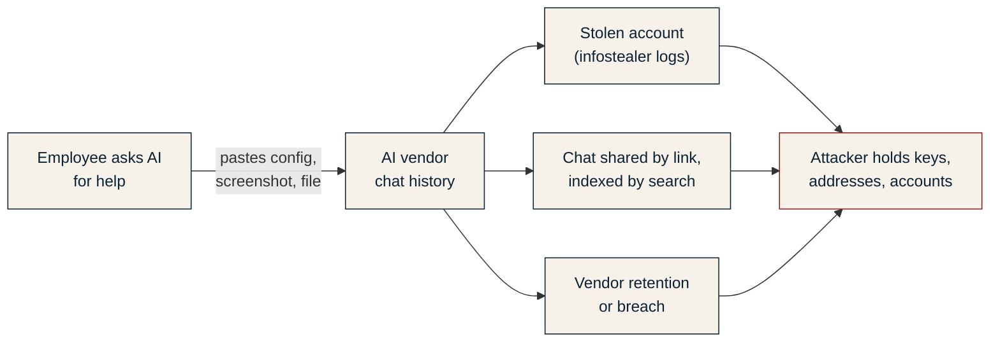

# Threat model

## The asset and the threat

**Asset:** the organisation's secrets that an attacker could use against it: classified
documents, credentials and keys, internal network details, account identifiers and open
security findings.

**Threat:** an employee, usually with no bad intent, sends them to a generative AI tool while
asking for help. From there the data is out of the organisation's control, and an attacker can
reach it without ever touching the organisation's network.

| Path | Evidence |
|---|---|
| Stolen AI accounts | Group-IB identified 101,134 infostealer-infected devices with saved ChatGPT credentials in logs traded between June 2022 and May 2023, and more than 225,000 logs containing ChatGPT credentials offered for sale between January and October 2023. |
| Shared chats indexed | In July 2025, Fast Company found nearly 4,500 shared ChatGPT conversations in Google results; OpenAI removed the discoverability option shortly afterwards. |
| Vendor retention | In March 2023, Samsung semiconductor engineers entered source code and meeting content into ChatGPT in three separate incidents within about 20 days; Samsung then banned generative AI tools on company devices from May 2023. |

## Channels and coverage

| Channel | Example | Covered by | State |
|---|---|---|---|
| Typed text | A password typed into the prompt | Extension, at send time | Built |
| Pasted text | A router configuration | Extension | Built |
| Dragged text | A selection dragged into the prompt | Extension | Built |
| Text-format file upload | `.env`, `.conf`, `.log`, source code | Extension, sanitised copy uploaded | Built |
| Images and screenshots | A SOC dashboard, a scanned memo | Extension + on-prem OCR | Built |
| PDF, Office, archives | A contract, an Excel export | Blocked whole (fail closed); parsing in Phase 2 | Partial |
| Desktop AI apps, IDE assistants | Copilot in an IDE | Endpoint agent | Phase 2 |
| Voice input | Dictated meeting notes | Local speech-to-text in the endpoint agent | Phase 2 |
| Personal AI account on a work device | Personal login on a public AI site | Identity layer, account checks | Phase 3 |
| Work data on a personal device | Home laptop | Conditional access keeps company data on managed devices; Gateway | Phase 3 and 4 |
| Phone camera, re-typing by hand | Photographing the screen | Not technically coverable | Policy and awareness |

**Assumptions.** The organisation manages its endpoints (domain-joined or MDM-enrolled), uses a
central identity provider, and has or will adopt a data classification scheme.

## Threats to SADIN itself

A security control has to survive the people and pages it sits between.

| Threat | Mitigation | State |
|---|---|---|
| Employee removes or disables the extension | Force-installed by `ExtensionInstallForcelist`; users cannot remove or disable a policy-installed extension | Built (policy) |
| Employee uses another browser | Application control (AppLocker or WDAC) allows only managed browsers | Deployment guidance |
| A website reads the decision log or writes fake events to the local service | The service refuses browser requests from any origin other than the SADIN extension, and requires a shared token in deployment | Fixed in v0.4.0 |
| Forged lines in the SIEM feed through a crafted field | Control characters are stripped from every logged field and CEF values are escaped | Fixed in v0.4.0 |
| Something pretends to be the inspection service | `serverUrl` and `serverToken` come from managed policy, not from the page; use TLS on the network | Built; TLS is deployment guidance |
| Inspection service is down | Images and uninspectable files are blocked (fail closed) | Built |
| The AI site changes how it uploads | The extension hooks user actions (paste, drop, file input, send), not the site's code; network-level interception for policy-installed extensions is a planned backstop | Partial |
| Obfuscation: splitting a secret across messages, spelling it out, encoding it | High-entropy detection catches long encoded strings; deliberate evasion by a determined insider is out of scope for a tool aimed at accidental leakage | Accepted |
| The log itself becomes sensitive | Metadata only: no text, no image, no matched value | Built |

## Residual risk

- A photograph of the screen with a personal phone cannot be stopped by any technical control.
  The answers are policy, awareness, and giving fewer people access to classified data.
- OCR misses some values: short lowercase hostnames, low-resolution images, handwriting and
  stylised Arabic fonts. Three of 72 seeded values were missed in the held-out screenshot test.
- Until Phase 2, a secret inside a PDF or Office file blocks the whole file instead of being
  redacted, which is safe but gets in the way of legitimate work.
- SADIN processes employee activity. Collecting more than needed is itself a privacy risk, which
  is why the log is limited to metadata, kept on premises, restricted by role and disclosed to
  employees.
